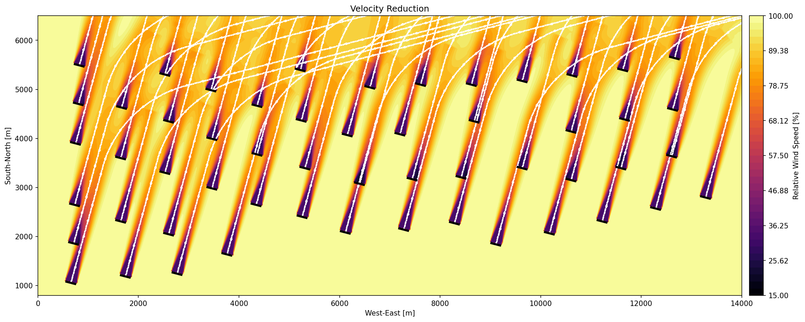

# Examples

```@meta
CurrentModule = FLORIDyn
```
## Basic example
This example uses 9 turbines in a 3x3 configuration. It is used for verification
purposes.

The configuration file is `2021_9T_Data.yaml` in the data folder.

## Nordsee One

Below is the wind farm layout used in the Nordsee One example:


Source: [https://www.nordseeone.com/windfarm](https://www.nordseeone.com/windfarm)

The configuration file is `2021_54T_NordseeOne.yaml` in the data folder.


### Velocity reduction visualization

The following figure shows the velocity reduction field produced by the example workflow (first selecting the second project using the first menu entry, then selecting the second menu entry):



The example assumes an inflow with constant wind speed and no turbulence. The wind direction changes during the simulation from `255°` to `195°`. The windfield was simulated for 20 minutes, while running the simulation on a laptop with an 7840U CPU took only 1.56s (without visualization). The wind direction is the direction where the wind is coming from, clockwise positive, with `0°` defined as wind from the North.


