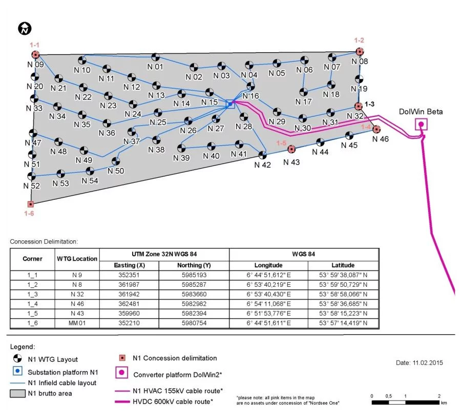

# Examples

```@meta
CurrentModule = FLORIDyn
```
## Basic example
This example uses 9 turbines in a 3x3 configuration. It is used for verification
purposes. One of the three flow field visualisations is the turbulence animation, showed here:


```@raw html
<style> .video-container {
  position: relative;
  width: 510px;
  max-width: 100%;
  aspect-ratio: 510 / 436; /* width / height */
  overflow: hidden;
  margin: 0 auto;
} .responsive-iframe { position: absolute; top: 0; left: 0; width: 100%; height: 100%; border: none; clip-path: inset(7px 1px 7px 1px);} </style> <div class="video-container"> <iframe src="https://www.dropbox.com/scl/fi/e5uonvron9eoa1vupsxgm/ff_added_turbulence_animation.mp4?rlkey=nk1fgm9d2xwurdldycwa8ih9w&st=2s7c2sm3&raw=1" class="responsive-iframe" allowfullscreen frameborder="0"></iframe> </div>
```

The configuration file is `2021_9T_Data.yaml` in the data folder.

## Nordsee One

Below is the wind farm layout used in the Nordsee One example:



Source: [https://www.nordseeone.com/windfarm](https://www.nordseeone.com/windfarm)

The configuration file is `2021_54T_NordseeOne.yaml` in the data folder.


### Velocity reduction visualization

The following video shows the velocity reduction field produced by the example workflow (first selecting the second project using the first menu entry, then selecting the second menu entry):

```@raw html
<div style="display: flex; justify-content: center;">
  <iframe src="https://www.dropbox.com/scl/fi/ckfdr9ap6hdfgxkpz36jd/ff_velocity_reduction_animation.mp4?rlkey=kgbxb9pvhx997c3b4vgytc8lf&st=ijcbs1xt&raw=1" height="378" width="943" allowfullscreen></iframe>
</div>
```

The example assumes an inflow with constant wind speed and no turbulence. The wind direction changes during the simulation from `255°` to `195°`. The windfield was simulated for 20 minutes, while running the simulation on a laptop with an 7840U CPU took only 1.56s (without visualization). The wind direction is the direction where the wind is coming from, clockwise positive, with `0°` defined as wind from the North.


