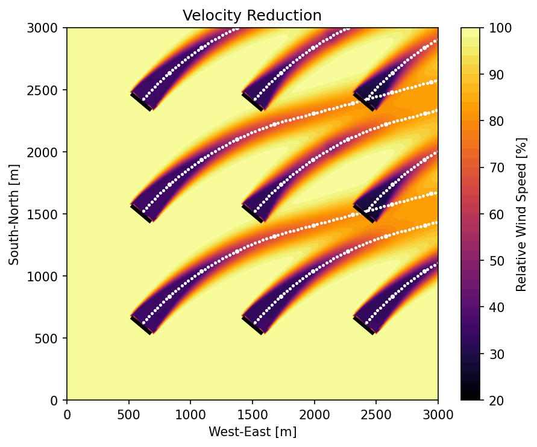

# Examples

```@meta
CurrentModule = FLORIDyn
```

## Nordsee One

Below is the wind farm layout used in the Nordsee One example:


The configuration file is `2021_54T_NordseeOne.yaml` in the data folder.


### Velocity reduction visualization

The following figure shows the velocity reduction field produced by the example workflow:




