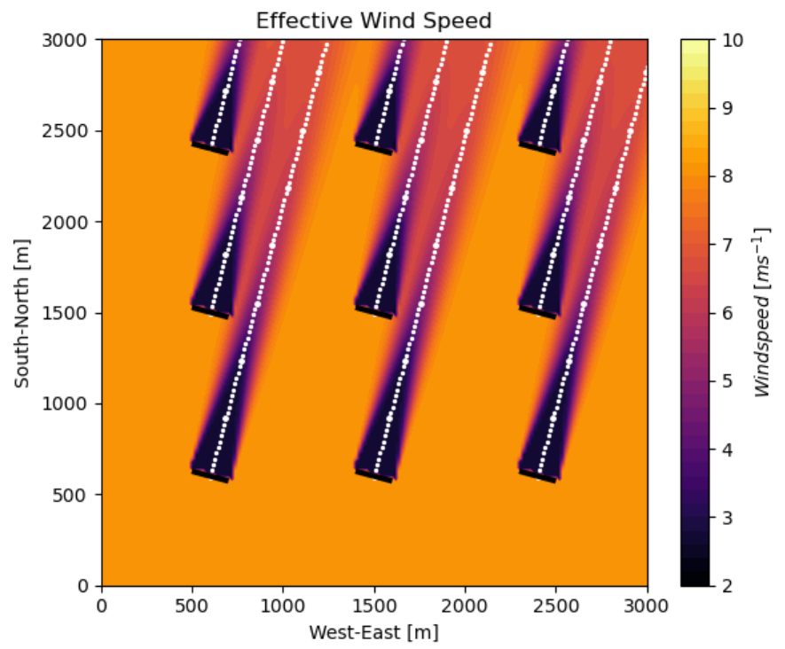

```@meta
CurrentModule = FLORIDyn
```

# FLORIDyn

## Introduction
A dynamic wind farm simulation software, translated from [FLORIDyn_Matlab](https://github.com/TUDelft-DataDrivenControl/FLORIDyn_Matlab), which was written by Marcus Becker.

The code uses the Gaussian wake model from the quasi static wind farm simulation software [FLORIS](https://github.com/NREL/floris), developed by NREL.

## Model features
- Simulate wind farms dynamically at a low computational cost
- Estimate the power generated, added turbulence, and wake-induced losses.
- Apply heterogeneous and time-varying wind speeds and directions
- Test different modeling approaches



## Status:
Five examples work, selectable via a menu:
```julia
include("examples/menu.jl")
```
A Python version of FLORIDyn is available at [https://github.com/TUDelft-DataDrivenControl/OFF](https://github.com/TUDelft-DataDrivenControl/OFF) .

## Installation
Install [Julia 1.10](https://ufechner7.github.io/2024/08/09/installing-julia-with-juliaup.html) or later, if you haven't already.

Before installing this software it is suggested to create a new project, for example like this:
```bash
mkdir test
cd test
julia --project=.
```
Don't forget to type the `dot` at the end of the last command.

Then add FLORIDyn from  Julia's package manager, by typing:
```julia
using Pkg
pkg"add https://github.com/ufechner7/FLORIDyn.jl"
``` 
at the Julia prompt. You can run the unit tests with the command:
```julia
pkg"test FLORIDyn"
```
You can install the examples using the following command:
```julia
using FLORIDyn
install_examples()
```
If you now quit Julia with <ctrl><d> and restart it with
```bash
./bin/run_julia
```
then you can get the example menu by typing:
```julia
menu()
```
You can select any of the examples with the `<UP>` and `<DOWN>` keys, and then press `<ENTER>`.

## References
Citation of the FLORIDyn model:
FLORIDyn - A dynamic and flexible framework for real-time wind farm control, M. Becker, D. Allaerts, J.W. van Wingerden, 2022, http://doi.org/10.1088/1742-6596/2265/3/032103

Used FLORIS model:
Experimental and theoretical study of wind turbine wakes in yawed conditions, M. Bastankhah, F. Porté-Agel, 2020, http://doi.org/10.1017/jfm.2016.595

Additional references for smaller subcomponents can be found in the code or in the related publications.
