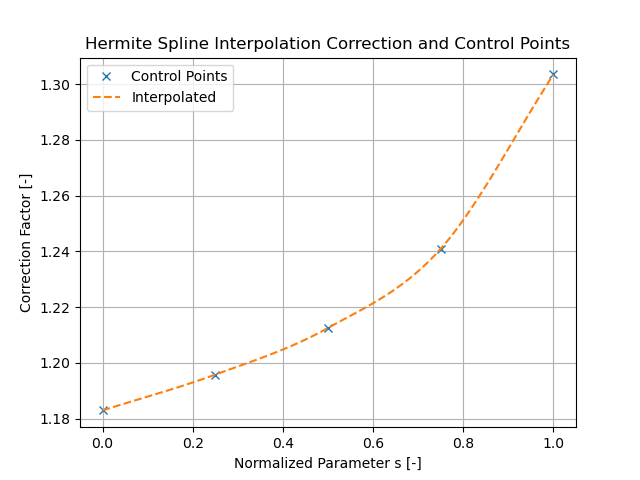
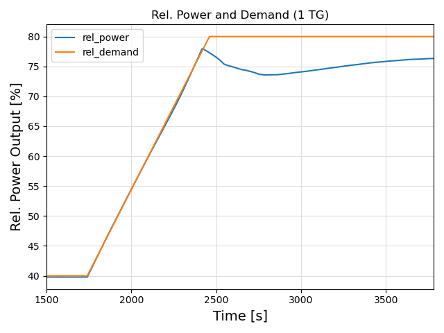

# Optimize the turbine induction factors

## Collective turbine control
The most simple way to match production and demand is to control the induction factor of the turbines of the wind farm cluster, assuming all use the same induction factor.

We assume
\begin{equation}
\label{eq:cp-max}
C_{\text{p,max}} = \frac{16}{27}
\end{equation}

Furthermore, we assume that the relative demand (relative to the power at free-flow velocity) is given as
\begin{equation}
\label{eq:demand-rel}
p_{\text{d,rel}} = d(t)
\end{equation}
At the beginning, the demand is 40%. At $t=t_\text{start}$ the demand starts to rise, and at $t=t_\text{end}$ it reaches 
80% and then stays constant. In the first test case we use $t_\text{start}=1740s$ and $t_\text{end}=2460s$. The resulting
demand profile is shown in Fig. \ref{fig:power-demand-1t}. 

The power coefficient of an ideal wind turbine is related to the induction factor following
\begin{equation}
\label{eq:cp-induction}
C_{\text{p}} = 4a(1-a)^2
\end{equation}
The inverse relationship $a(C_{\text{p}})$ is obtained by numerically solving this equation for $a \in [0, 1/3]$.

By combining Eqs. \eqref{eq:cp-max}, \eqref{eq:demand-rel} and \eqref{eq:cp-induction}, and applying $C_{\text{p}} = d(t) \cdot C_{\text{p,max}}$ we can write:
\begin{equation}
\label{eq:induction-time}
a = f(d(t))
\end{equation}

This would be correct without wakes. Because of the wake effects, we need to increase the
set-power of the turbines with a correction factor. This - time dependent - correction factor
is defined as a cubic Hermite spline, based on $n$ control points. The first control point defines the correction 
for $t <= t_\text{start}$, the last control point defines the correction for $t >= t_\text{end}$, and the additional 
control points are distributed evenly between the first and the last point.

The correction function is defined as a piecewise cubic Hermite spline:
\begin{equation}
\label{eq:correction-func}
c(t) = \begin{cases}
c_1 & \text{if } t \leq t_{\text{start}} \\
H_i(s) & \text{if } t_{\text{start}} < t < t_{\text{end}} \\
c_n & \text{if } t \geq t_{\text{end}}
\end{cases}
\end{equation}

where $s = \frac{t - t_{\text{start}}}{t_{\text{end}} - t_{\text{start}}}$ is the normalized time parameter $s \in [0, 1]$, and $H_i(s)$ is the cubic Hermite interpolation between control points $c_i$ at positions $s_i = \frac{i-1}{n-1}$ for $i = 1, \ldots, n$.

For each segment between control points, the Hermite spline is given by:
\begin{equation}
\label{eq:hermite-spline}
H_i(s) = h_{00}(u) \cdot c_i + h_{10}(u) \cdot m_i \cdot \Delta s + h_{01}(u) \cdot c_{i+1} + h_{11}(u) \cdot m_{i+1} \cdot \Delta s
\end{equation}

where $u = \frac{s - s_i}{\Delta s}$ with $\Delta s = \frac{1}{n-1}$, and the Hermite basis functions are:
\begin{align}
h_{00}(u) &= 2u^3 - 3u^2 + 1 \\
h_{10}(u) &= u^3 - 2u^2 + u \\
h_{01}(u) &= -2u^3 + 3u^2 \\
h_{11}(u) &= u^3 - u^2
\end{align}

The tangents $m_i$ at each control point are computed using central differences:
\begin{equation}
\label{eq:tangents}
m_i = \begin{cases}
\frac{c_2 - c_1}{\Delta s} & \text{if } i = 1 \\
\frac{c_{i+1} - c_{i-1}}{2\Delta s} & \text{if } 1 < i < n \\
\frac{c_n - c_{n-1}}{\Delta s} & \text{if } i = n
\end{cases}
\end{equation}

To obtain the vector of the control points
\begin{equation}
\label{eq:control_points}
\mathbf{c} = c_1, ..., c_n
\end{equation}

we solve the following optimization problem using the NOMAD [@montoison-pascal-salomon-nomad-2020] optimizer:
\begin{equation}
\label{eq:optimization}
\min_{\mathbf{c}} \sum_{t=t_{\text{start}}}^{t_{\text{end}}+t_{\text{extra}}} \left(p(t) - d(t) \right)^2
\end{equation}
where $p(t)$ is the relative wind park power output at time $t$, $t_{\text{start}}$ is the time when the demand starts to increase, $t_{\text{end}}$ the time when it reaches its maximum and $t_{\text{extra}}$ the time the wind field needs to reach its equilibrium.

Fig. \ref{fig:correction-factor} shows optimal correction factors as a function of the normalized parameter $s$ as determined by the optimizer. The curve is rising when the demand is rising. This makes sense, because a higher demand causes higher induction factors, which cause more wake losses that need to be compensated.

{width=70%}

If we combine Eq. \ref{eq:induction-time} and Eq. \ref{eq:correction-func}, we get
\begin{equation}
\label{eq:induction-time-corrected}
a = f(c(t) * d(t))
\end{equation}

Using this equation, we can calculate the vector of the induction factors
\begin{equation}
\mathbf{a} = a_1, ..., a_m
\end{equation}
for each time step of the simulation. Fig. \ref{fig:induction-factor} shows optimal induction factors as a function of time as calculated by the optimizer.

{width=70%}

Using these induction factors as input, the result of the FLORIDyn [@becker2022floridyn] simulation is the vector
\begin{equation}
\mathbf{p} = p_1, ..., p_m
\end{equation}
of the relative wind park power (relative to the power without wakes at free-flow wind speed).

Fig. \ref{fig:power-demand-1t} shows the resulting relative wind park power and relative demand as a function of time:

{width=70%}

## Turbine group (TG) control
To improve the tracking between production and demand, the turbines are now divided in (approximately) equal sized groups. The grouping is done depending on the coordinate of each turbine in the mean wind direction, such that the most upwind group of turbines has number one. 

The axial induction factor $a$ of each turbine group shall be controlled to achieve the best match between power demand and power production. To achieve this goal, in addition to the vector $\mathbf{c}$ as defined in Eq. \ref{eq:control_points} we need a second vector that controls the power distribution of the turbine groups. We define the vector $\mathbf{e}$ with $u$ elements as
\begin{equation}
\mathbf{e} = e_1 \ldots e_u, \quad 1 \leq e_i \leq 3
\end{equation}
with $u$ being the number of turbine groups and
\begin{equation}
e_u = \frac{3}{2} u - \sum_{i=1}^{u-1} e_i
\end{equation}
With this definition we achieve the goal that the mean of the elements of $\mathbf{e}$ is $1.5$ and thus constant. Changing $e_1 .. e_{u-1}$ shall only modify the distribution of the power between the turbine groups, but not the total free-stream power. The variables $e_1 .. d_{e-1}$ are the additional free variables that need to be optimized.

The cost function (Eq. \ref{eq:optimization}) stays the same, but Eq. \ref{eq:induction-time-corrected} must be extended. We do this in
two steps: First, we calculate the power that a turbine group shall contribute to the total power. We do that such that for $e_\text{i}=0$ the turbine group works at full power all the time, for $e_\text{i}=1$ it contributes exactly the free-stream power that would mach the demand, for higher values of $e_\text{i}$ it contributes less, and for values above two the contribution at the beginning is zero and the turbine starts to operate later. We do this because we know that at the end of the rise of the demand all available power is needed, and at the beginning some of the turbine groups should produce nothing or less than their full share.
\begin{equation}
p_\text{set,i} = c(t) \big(p_\text{max} - e_\text{i} (p_\text{max} - d(t))\big)
\end{equation}
We use the same, time dependent correction function $c(t)$ for all turbine groups, but the required relative power per turbine group is corrected using the formula given above.

This value is than limited to the valid range between zero and one and finally used to calculate the required induction factor:

\begin{equation}
\label{eq:induction_tg}
a_i = f(\text{clamp}(p_\text{set,i}, 0, 1))
\end{equation}

# References