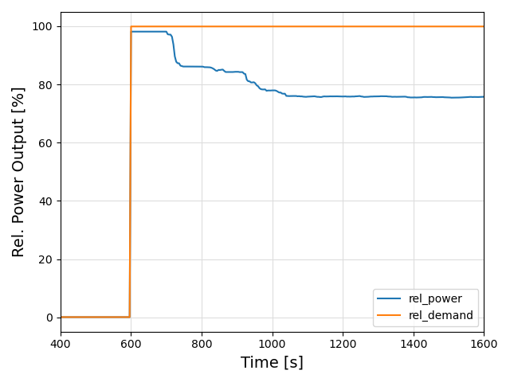

# Step response of a wind field

This test case can be used to estimate the peak power and integrated energy that a wind field can store to better meet the demand of the grid.



```
--- Wind Conditions ---
Free-flow wind speed: 8.2 m/s
Turbulence intensity: 6.2%

--- Analysis of Power Output ---
Relative peak power:  98.13%
Relative final power: 75.71%
Extra power:          22.42%
Storage time at full power: 50.96s
```

## TODO
