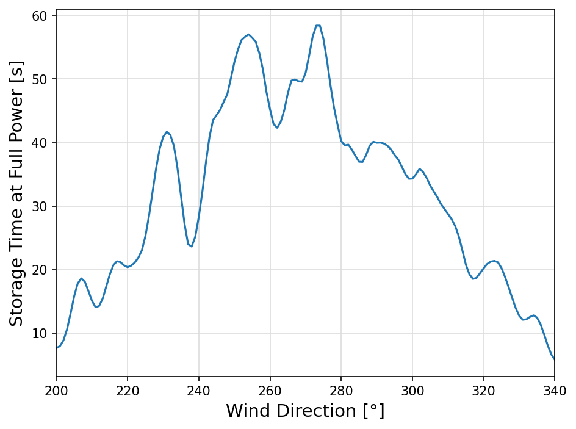

# Step response of a wind field

This test case can be used to estimate the peak power and integrated energy that a wind field can store to better meet the demand of the grid.

## Test case for wind_dir = 270 degrees

{ width=80% }

```
--- Wind Conditions ---
Free-flow wind speed: 8.2 m/s
Turbulence intensity: 6.2%

--- Analysis of Power Output ---
Relative peak power:  98.13%
Relative final power: 75.71%
Extra power:          22.42%
Storage time at full power: 50.96s
```

\newpage

## Test with wind_dir = 200 .. 340 degrees

{ width=80% }

\newpage

### Extra Power vs Wind Direction

{ width=69% }

### Storage Time vs Wind Direction

{ width=69% }

### Extra Power and Storage Time (Combined)

The combined plot overlays extra power percentage and storage time to make it easy to identify wind directions that maximize both short-term peak exploitation and sustained energy delivery.

{ width=80% }

# Step response of a wind field

This test case can be used to estimate the peak power and integrated energy that a wind field can store to better meet the demand of the grid.

## Test case for wind_dir = 270 degrees

{ width=80% }

```
--- Wind Conditions ---
Free-flow wind speed: 8.2 m/s
Turbulence intensity: 6.2%

--- Analysis of Power Output ---
Relative peak power:  98.13%
Relative final power: 75.71%
Extra power:          22.42%
Storage time at full power: 50.96s
```

\newpage

## Test with wind_dir = 200 .. 340 degrees

{ width=80% }

\newpage

### Extra Power vs Wind Direction

{ width=69% }

### Storage Time vs Wind Direction

{ width=69% }

